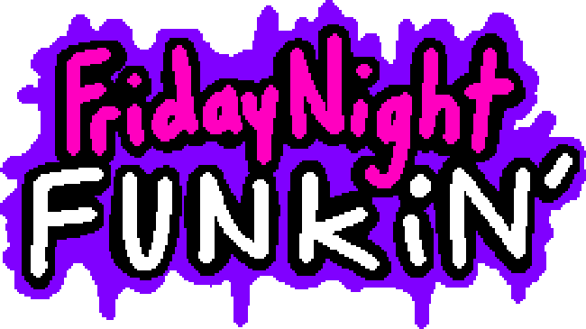
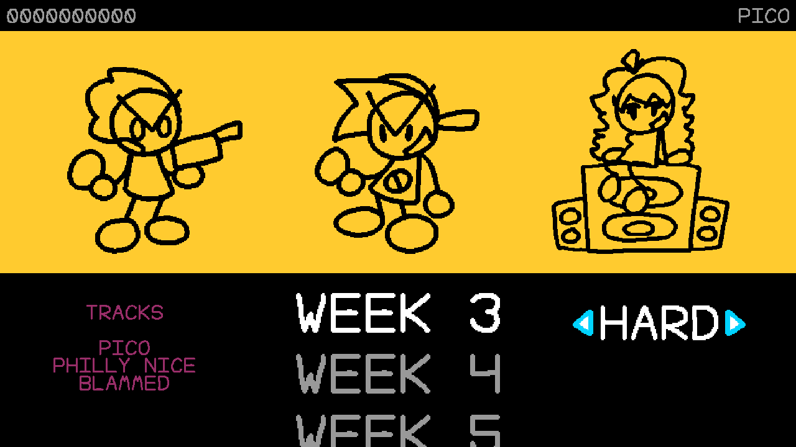
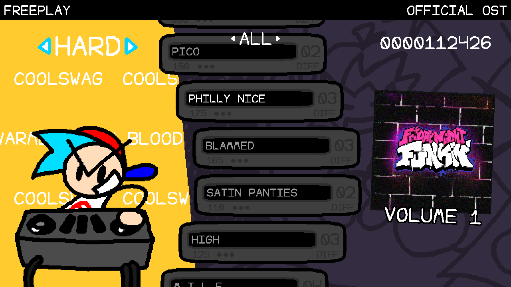

<h1 align="center">Friday Night Funkin' WTF Engine</h1>

WTF Engine is the best worst [Friday Night Funkin'](https://github.com/FunkinCrew/Funkin) engine out there. What this engine does differently is the art. Rather than using FNF's premade and visually pleasing graphics, this engine uses the shittiest possible art.

<table>
    <tr>
        <td></td>
        <td></td>
    </tr>
</table>

Why should you even use this engine? The engine pretty much exists as a joke. The content made using this engine should be done for the fun of it.

## Compiling

To compile the engine, please check out [COMPILING.md](docs/COMPILING.md).

## Credits

- [Virtu](https://github.com/realvirtu) - Made the engine.
- [FunkinCrew](https://github.com/FunkinCrew) - Made the disgusting game.

## Special Thanks

- [FunkinCrew](https://github.com/FunkinCrew) - Their game is the reason why this engine exists.
- [Funkin' Contributors](https://www.youtube.com/@TheFunkinContributors) - Amazing people.
- WTF Engine Contributors - Thank.